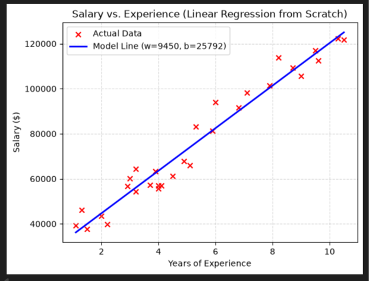

### Summary of What's Inside the Guide

Here is a breakdown of how the Markdown document explains all the concepts you found challenging, along with the analysis of your **Salary vs. Experience** graph:

---

### 1. De-Bunking Common Pitfalls & Difficult Concepts

* **Cost Function Interpretation (Cost = 0.58):**
  * Explains why $0.58$ is **not** $0.58\%$ or $0.58$ times inaccurate.
  * Shows how taking the square root gives **Root Mean Squared Error ($\text{RMSE} = \sqrt{0.58} \approx 0.76$)**, meaning your predictions are off by **0.76 units on average** (e.g., $\$760$ or $0.76^\circ\text{C}$).
* **Inputs vs. Features vs. Weights vs. Parameters:**
  * **Inputs/Features ($x$):** The fixed real-world facts you give the model (e.g., Years of Experience).
  * **Weights ($w$):** The **slope** of the line (how much $y$ changes per unit of $x$).
  * **Bias ($b$):** The **y-intercept** (the base starting value when $x = 0$).
  * **Parameters:** The umbrella term for all trainable knobs ($w$ and $b$).
* **Why Gradient Descent instead of Graphing?**
  * Graphing work fine for 2 parameters (3D contour plots), but real-world models have thousands or billions of parameters ($w_1, w_2, \dots, w_n$).
  * Demonstrates the **Blindfolded Mountain Climber Analogy**—Gradient Descent finds the bottom of the bowl by feeling the local slope (derivatives) rather than drawing the whole map.
* **Deriving the Partial Derivatives ($\frac{\partial J}{\partial w}$ and $\frac{\partial J}{\partial b}$):**
  * Step-by-step calculus showing how the $\frac{1}{2m}$ in the cost function cancels out with the exponent $2$ when using the Power Rule.
  * Shows how multiplying by the inner derivative yields $x^{(i)}$ for $w$, and $1$ for $b$.
* **Connecting Math Summation ($\sum$) to Python (`for` loops):**
  * Uses the **Teacher Grading Papers** analogy to explain how the loop tallies errors paper-by-paper (`dj_db += error`) before dividing by $m$ at the end.
* **Selecting & Debugging the Learning Rate ($\alpha$):**
  * Compares small $\alpha$ (too slow) vs. large $\alpha$ (divergence / overshooting) vs. Goldilocks $\alpha$.
  * Includes a code snippet to automatically detect when cost increases and stop execution before the model explodes.

---

### 2. Case Study Analysis: Salary vs. Experience (Line of Best Fit)

Using the image you provided:
* **The Model Equation:** $$\text{Predicted Salary} = 9450 \cdot (\text{Years of Experience}) + 25792$$
* **Bias ($b = 25792$):** The starting base salary for an employee with **0 years of experience** is **$\$25,792$** (the point where the blue line touches the y-axis).
* **Weight ($w = 9450$):** For **every 1 additional year of experience**, the predicted salary increases by **$\$9,450$** (the slope of the line).
* **How Gradient Descent found it:** Started with initial guesses ($w=0, b=0$), calculated the vertical distance (residuals) between each red cross and the line, and stepped downhill iteration by iteration until it minimized the total squared distance—yielding the **line of best fit**.

---
